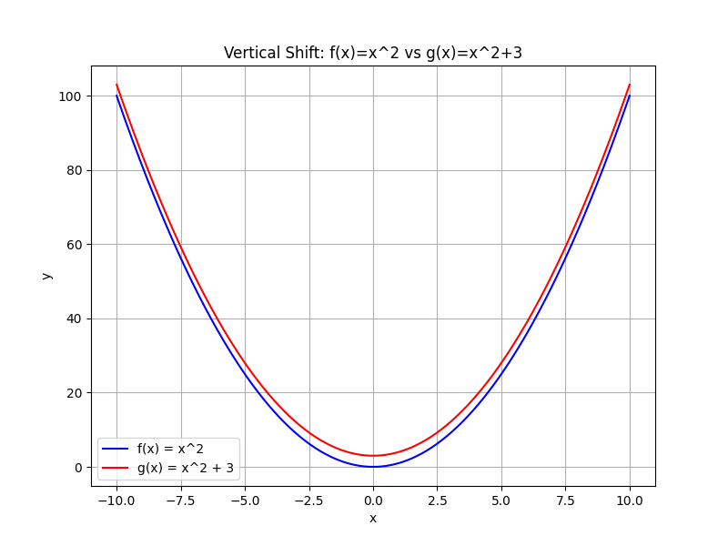
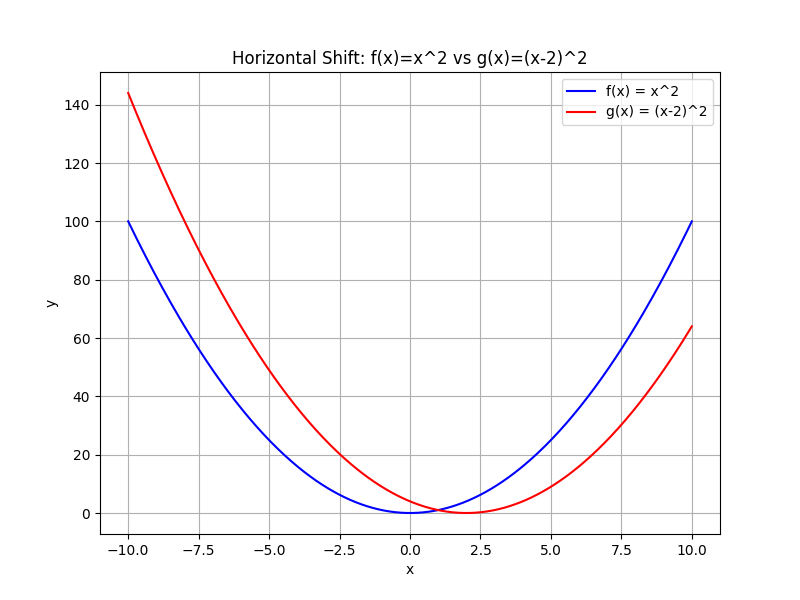
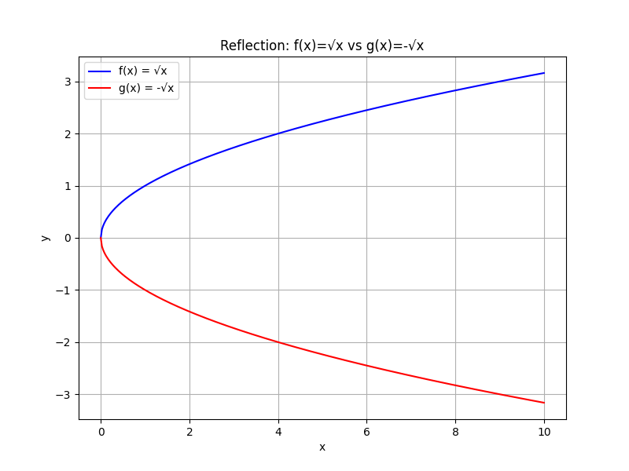
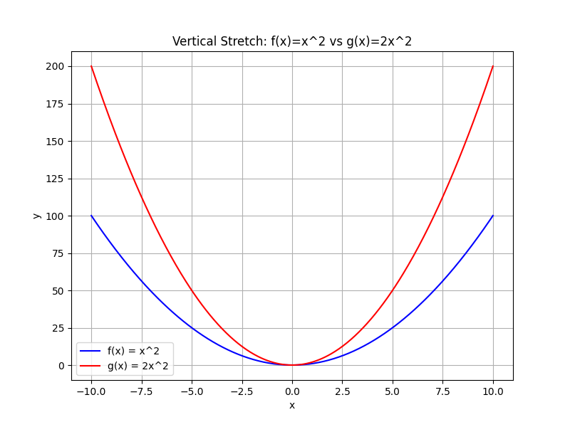
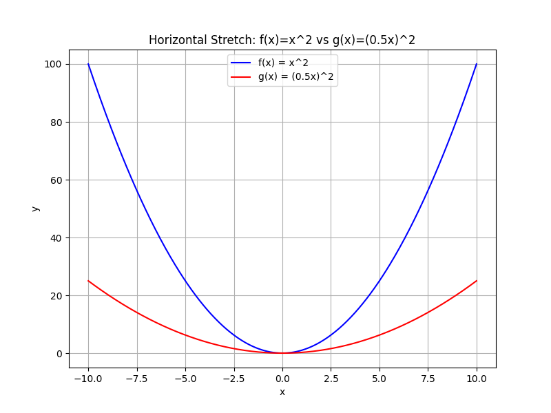
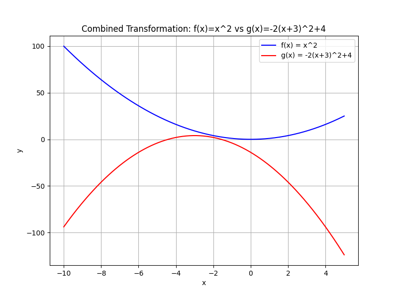
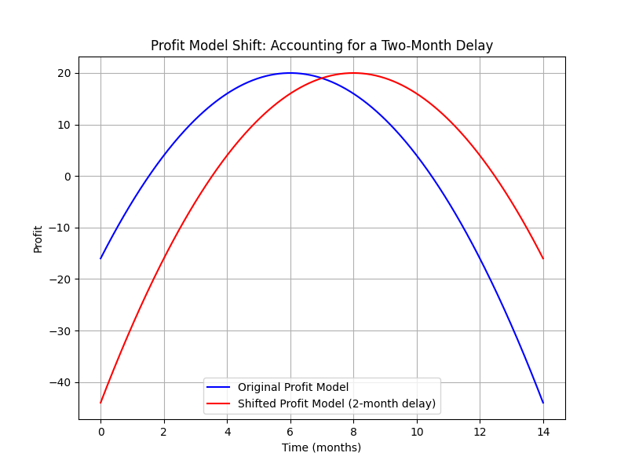

## Function Transformations and Shifts

Function transformations allow us to modify a basic graph by shifting, stretching, compressing, or reflecting it. In this lesson we explore how changing the equation of a function affects its graph. We cover vertical and horizontal shifts, reflections, and scaling transformations with detailed, step-by-step examples. These modifications help you understand how algebraic changes translate into visual movements and shape changes in the graph.

### 1. Basic Concepts

A function is a rule that assigns an output to each input, much like a machine that takes $x$ as an input and produces a corresponding $y$. When we change a function's formula, the entire graph moves or changes shape. This is the essence of a transformation.

The basic function is written as

$$
f(x)
$$

A transformed function is often expressed as

$$
g(x) = a\,f(b(x - h)) + k,
$$

where:

- $h$ represents a horizontal shift (moving the graph left or right).
- $k$ represents a vertical shift (moving the graph up or down).
- $a$ is the vertical stretch or compression factor. If $|a| > 1$, the graph is stretched vertically; if $0 < |a| < 1$, it is compressed vertically. A negative value of $a$ also reflects the graph across the horizontal axis.
- $b$ affects the horizontal stretch or compression. If $|b| > 1$, the graph compresses horizontally; if $0 < |b| < 1$, it stretches horizontally. A negative $b$ reflects the graph across the vertical axis.

These parameters allow us to tailor the graph to match various behaviors observed in real-world scenarios.

### 2. Vertical and Horizontal Shifts

**Vertical Shifts:**

Adding a constant $k$ to the function shifts the graph vertically. When $k > 0$, the graph moves upward; when $k < 0$, it moves downward. This kind of shift does not change the shape of the graph—it only changes its position along the $y$-axis.

Example: Given $f(x)=x^2$, the function

$$
g(x)=f(x)+3=x^2+3
$$

shifts the parabola upward by 3 units. This means every point on $f(x)$ is moved 3 units higher.

Below is a graph comparing $f(x)=x^2$ (blue) and $g(x)=x^2+3$ (red):

**Horizontal Shifts:**

Replacing $x$ by $(x-h)$ in the function produces a horizontal shift. Note that this operation can seem counterintuitive: if $h$ is positive, the graph shifts to the right, and if $h$ is negative, it shifts to the left.

Example: For $f(x)=x^2$, the function

$$
g(x)=f(x-2)=(x-2)^2
$$

shifts the graph to the right by 2 units. This means every point on $f(x)$ is moved 2 units to the right along the $x$-axis.

Below is a graph comparing $f(x)=x^2$ (blue) and $g(x)=(x-2)^2$ (red):

### 3. Reflections

Reflections flip the graph over a designated axis. Reflecting over the horizontal axis is achieved by multiplying the function by $-1$, which reverses the sign of all output values. Reflecting over the vertical axis involves replacing $x$ with $-x$, reversing the sign of the input values.

Example: With $f(x)=\sqrt{x}$, the function

$$
g(x)=-\sqrt{x}
$$

reflects the graph downward, meaning every point on $f(x)$ is mirrored across the $x$-axis.

Below is a graph comparing $f(x)=\sqrt{x}$ (blue) and $g(x)=-\sqrt{x}$ (red):

### 4. Stretching and Compressing

**Vertical Stretch/Compression:**

Multiplying $f(x)$ by a constant $a$ scales the graph vertically. If $|a| > 1$, the graph stretches vertically, making it taller; if $0 < |a| < 1$, the graph compresses vertically, making it shorter. If $a$ is negative, the graph is also reflected across the horizontal axis.

Example: For $f(x)=x^2$, the function

$$
g(x)=2x^2
$$

stretches the parabola vertically by a factor of 2, meaning every $y$-value is doubled.

Below is a graph comparing $f(x)=x^2$ (blue) and $g(x)=2x^2$ (red):

**Horizontal Stretch/Compression:**

Multiplying the input $x$ by a constant $b$ affects the graph horizontally. Specifically, if $|b| > 1$, the graph compresses horizontally (it appears narrower), and if $0 < |b| < 1$, the graph stretches horizontally (it appears wider).

Example: For $f(x)=x^2$, the function

$$
g(x)=\left(0.5x\right)^2=0.25x^2
$$

results in a horizontal stretch that makes the parabola wider, as each $x$-value is effectively scaled down by a factor of 0.5.

Below is a graph comparing $f(x)=x^2$ (blue) and $g(x)=(0.5x)^2$ (red):

### 5. Combining Transformations: Step-by-Step Example

Consider the transformation of the function $f(x)=x^2$ into

$$
g(x)=-2\,(x+3)^2+4.
$$

This example combines several transformations in one function. Follow these steps to understand the process:

1. **Horizontal Shift:**

   The term $(x+3)$ can be rewritten as $(x-(-3))$. This means the graph is shifted 3 units to the left. Intuitively, every point on $f(x)$ is moved leftward by 3 units.

2. **Vertical Stretch and Reflection:**

   The factor $-2$ causes two effects. The absolute value, 2, stretches the graph vertically, making it taller. The negative sign reflects the graph across the horizontal axis, flipping it upside down.

3. **Vertical Shift:**

   Finally, adding 4 shifts the graph upward by 4 units. This moves every point on the transformed graph up by 4 units along the $y$-axis.

**Summary of Effects:**

- Shift left by 3 units.
- Reflect over the horizontal axis and stretch vertically by a factor of 2.
- Shift up by 4 units.

Below is a graph comparing $f(x)=x^2$ (blue) and the transformed function $g(x)=-2(x+3)^2+4$ (red):

### 6. Real-World Application

Function transformations have practical applications in many fields. In finance, for example, a basic profit function $P(x)$ may represent profit based on sales $x$. If market conditions change, a vertical shift might account for increasing fixed costs or pricing adjustments, while a horizontal shift can model a delay in sales or market entry. This allows you to adjust the model to better reflect real-world performance.

Below is a conceptual graph where a profit model is shifted to account for a two-month delay in the market:

This graph clearly demonstrates how a horizontal shift can represent a delay or adjustment in timing, such as a shift in market response.

### 7. Practice Transformation Problems

To solidify your understanding, consider these guided examples. Work through the steps on your own to see how the graph of the function changes with each transformation:

- Given $f(x)=|x|$, graph $g(x)=|x-4|-3$ and identify the horizontal and vertical shifts.
- For $f(x)=\sqrt{x}$, graph $h(x)=-\sqrt{2x+6}+1$ and determine the order of operations along with the effect of each transformation.
- With $f(x)=\frac{1}{x}$, graph $k(x)=\frac{-1}{2(x+1)}+3$, noting both reflection and scaling effects.

Each of these examples reinforces the connection between the algebraic modifications and their corresponding graphical changes. By mastering function transformations, you build a strong foundation for analyzing and modeling real-world scenarios using algebra.