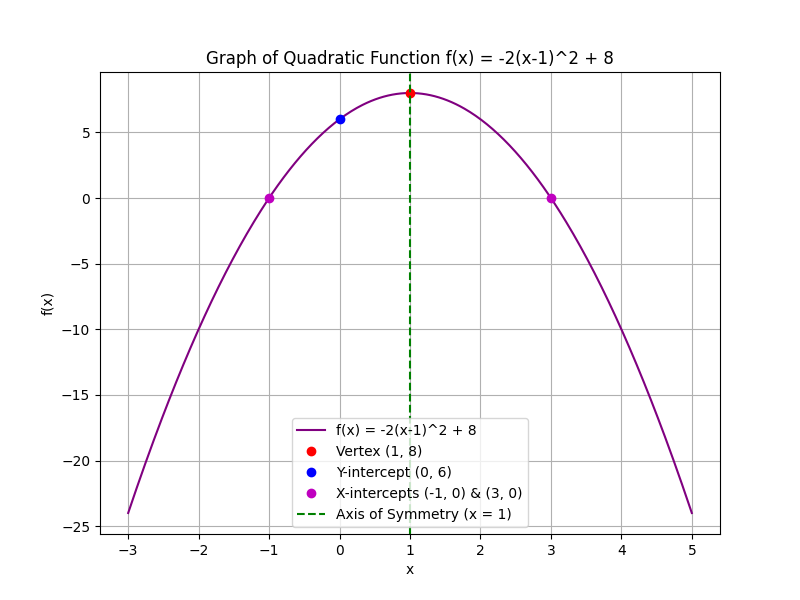

## Graphing and Analyzing Quadratic Functions

Quadratic functions are polynomial functions of degree 2 and are often written as

$$
f(x)=ax^2+bx+c
$$

These functions produce parabolic graphs. The parabola opens upward when $a>0$, meaning the function has a minimum point, and downward when $a<0$, meaning it has a maximum point. This behavior is crucial when modeling situations such as projectile motion or determining maximum profit.

### Key Features of Quadratic Functions

A quadratic function has several important features that help us understand its graph:

- **Vertex:** The vertex is the highest or lowest point on the parabola. It represents the optimal value in many real-world models.

- **Axis of Symmetry:** This is the vertical line that passes through the vertex. It splits the parabola into two mirror-image halves.

- **Intercepts:** These are the points where the graph crosses the axes:

  - **Y-intercept:** Occurs when $x=0$, which gives the point $(0, c)$.

  - **X-intercepts:** Occur where $f(x)=0$. They can be found by factoring the quadratic or using the quadratic formula.

The vertex can be calculated using the formula

$$
h=-\frac{b}{2a}
$$

After finding $h$, substitute it into $f(x)$ to find $k$, so the vertex is located at $(h, k)$. This method is especially useful for quickly identifying the most important feature of the parabola.

### Graphing a Quadratic Function

To graph any quadratic function, follow these steps:

1. **Identify the coefficients:** Determine $a$, $b$, and $c$ from the function. These values control the shape and position of the parabola.

2. **Calculate the vertex:** Use the formula $h=-\frac{b}{2a}$ to find the $x$-coordinate of the vertex. Then compute $k=f(h)$ to get the $y$-coordinate.

3. **Determine the y-intercept:** Evaluate $f(0)$ to find the point where the graph crosses the $y$-axis, which is $(0, c)$.

4. **Find the x-intercepts:** Solve the equation $ax^2+bx+c=0$ either by factoring or by applying the quadratic formula:

   $$
x=\frac{-b\pm\sqrt{b^2-4ac}}{2a}
   $$

   The solutions provide the feet of the parabola on the $x$-axis if they are real.

5. **Sketch the axis of symmetry:** Draw the vertical line $x=h$. This line is a guide for plotting symmetrical points on both sides of the vertex.

6. **Plot key points:** Mark the vertex, intercepts, and additional points on either side of the axis of symmetry. Finally, draw a smooth curve through these points to complete the parabola.

### Example 1: Graphing $f(x)=x^2-4x+3$

We begin with the function $f(x)=x^2-4x+3$. This example demonstrates the standard steps to graph a quadratic function.

1. **Identify the coefficients:**

   $$
a=1, \quad b=-4, \quad c=3.
   $$

2. **Find the vertex:**

   Calculate the $x$-coordinate:

   $$
h=-\frac{-4}{2(1)}=\frac{4}{2}=2.
   $$

   Now, find the $y$-coordinate by evaluating $f(2)$:

   $$
f(2)=2^2-4(2)+3=4-8+3=-1.
   $$

   Thus, the vertex is $(2,-1)$. This point represents the minimum of the parabola since $a$ is positive.

3. **Axis of symmetry:** The line $x=2$ divides the parabola into symmetric halves.

4. **Determine the y-intercept:**

   $$
f(0)=0^2-4(0)+3=3,
   $$

   so the y-intercept is $(0,3)$.

5. **Find the x-intercepts:** Solve

   $$
x^2-4x+3=0.
   $$

   Factoring gives:

   $$
(x-1)(x-3)=0,
   $$

   resulting in $x=1$ and $x=3$. The x-intercepts are $(1,0)$ and $(3,0)$.

6. **Graphing:** Plot the vertex, intercepts, and additional points. Connect them with a smooth curve to form the parabola.

> The vertex is vital as it indicates the point of minimum or maximum value in applications such as determining the best outcome in a profit function.

Below is a graphical representation of the function $f(x)=x^2-4x+3$:

<!-- tikzpicture -->

### Example 2: Analyzing $f(x)=-2(x-1)^2+8$

This quadratic function is in vertex form, which makes key features more apparent:

$$
f(x)=-2(x-1)^2+8.
$$

1. **Identify the vertex:** The vertex is directly given by the form $(h,k)$. Here, the vertex is $(1,8)$.

2. **Determine the direction:** Since $a=-2$ is negative, the parabola opens downward, indicating that the function has a maximum value at the vertex.

3. **Find the y-intercept:** Set $x=0$ to obtain:

   $$
f(0)=-2(0-1)^2+8=-2(1)+8=6.
   $$

   Thus, the y-intercept is $(0,6)$.

4. **Find the x-intercepts:** Solve for $x$ when $f(x)=0$:

   $$
-2(x-1)^2+8=0.
   $$

   Rearrange to isolate the quadratic expression:

   $$
-2(x-1)^2=-8 \quad\Longrightarrow\quad (x-1)^2=4.
   $$

   Taking the square root of both sides, we get:

   $$
x-1=\pm 2.
   $$

   Thus, $x=1\pm2$, which results in $x=-1$ and $x=3$. The x-intercepts are $(-1,0)$ and $(3,0)$.

5. **Graphing:** Plot the vertex $(1,8)$, the y-intercept $(0,6)$, and the x-intercepts $(-1,0)$ and $(3,0)$. Sketch the parabola opening downward based on these points.

> Analyzing the quadratic function in vertex form can offer quick insights. For instance, the vertex immediately shows the maximum profit in an economic model or the peak height in a projectile motion problem.

Below is a graphical representation of the function $f(x)=-2(x-1)^2+8$:

<!-- tikzpicture -->

### Real-World Applications

Quadratic functions are widely used to model real-world situations. Some examples include:

- **Projectile Motion:** The path of a thrown or launched object follows a parabolic arc, which is modeled by a quadratic function.

- **Architecture:** The design of arches and bridges often uses parabolic curves to distribute weight efficiently.

- **Economics:** Profit, cost, and revenue models can be represented by quadratic functions to determine optimal outcomes.

- **Sports Analytics:** The trajectory of a ball in sports like basketball or soccer is often parabolic in nature.

Understanding how to graph and analyze quadratic functions equips you to model and solve these practical problems effectively. The detailed steps help in systematically breaking down the function into key components, ensuring that you can tackle both academic problems and real-life applications confidently.