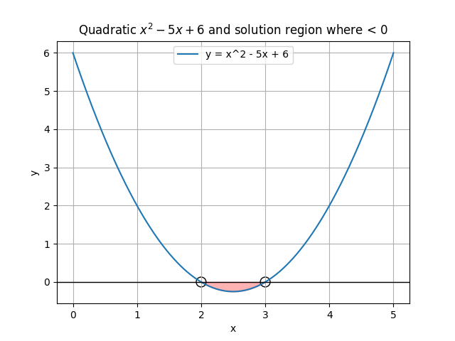
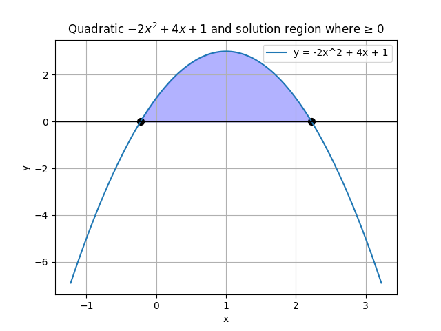

## Solving and Graphing Quadratic Inequalities

In this lesson, we will learn how to solve and graph quadratic inequalities. A quadratic inequality has the form

$$
a x^2 + b x + c \; (<, \leq, >, \geq) \; 0
$$

where $a$, $b$, and $c$ are constants, and the inequality symbol can be any of $<$, $\leq$, $>$, or $\geq$. Understanding these inequalities is important because they describe ranges of values that satisfy a condition. They appear in real-world applications such as determining safe operating conditions in engineering or finding profit intervals in financial planning.

### Step 1: Find the Critical Points

The first step in solving a quadratic inequality is to find the values of $x$ where the quadratic expression equals zero. These values, known as critical points, divide the number line into different intervals. Solving the equation

$$
a x^2 + b x + c = 0
$$

helps us determine where the expression may change sign. You can solve this quadratic equation by factoring, completing the square, or using the quadratic formula:

$$
x = \frac{-b \pm \sqrt{b^2 - 4ac}}{2a}
$$

The values obtained are the boundaries where the quadratic function transitions from positive to negative or vice versa. Understanding these transition points is key to knowing where the inequality holds.

### Step 2: Determine the Intervals and Test for Signs

After finding the critical points, use them to split the number line into separate intervals. For instance, if the quadratic equation has solutions $x = r$ and $x = s$ with $r < s$, the number line is divided into three intervals:

- $x < r$
- $r < x < s$
- $x > s$

For each interval, select a test point and substitute it into the quadratic expression to check its sign (positive or negative). This step confirms which intervals satisfy the inequality and gives an intuitive understanding of where the quadratic function is above or below the horizontal axis.

### Step 3: Write the Solution

After determining the sign of the quadratic expression in each interval, select the intervals that meet the original inequality condition. It is important to recall that the critical points themselves may or may not be part of the solution. For strict inequalities (using $<$ or $>$), do not include the critical points. For non-strict inequalities (using $\leq$ or $\geq$), include the endpoints in the solution.

> Key Insight: The critical points are the places where the function changes its behavior. Always consider whether these points should be included based on the inequality sign.

### Example 1: Solve and Graph the Inequality

Solve the inequality:

$$
x^2 - 5x + 6 < 0
$$

**Step 1:** Factor the quadratic expression:

$$
x^2 - 5x + 6 = (x-2)(x-3)
$$

The factors give the critical points $x = 2$ and $x = 3$.

**Step 2:** Determine the intervals and test the sign:

- For $x < 2$, choose $x = 1$:

  $$
  (1-2)(1-3) = (-1)(-2) = 2 > 0
  $$

  The expression is positive in this interval.

- For $2 < x < 3$, choose $x = 2.5$:

  $$
  (2.5-2)(2.5-3) = (0.5)(-0.5) = -0.25 < 0
  $$

  The expression is negative in this interval.

- For $x > 3$, choose $x = 4$:

  $$
  (4-2)(4-3) = (2)(1) = 2 > 0
  $$

  The expression is positive again.

**Step 3:** Write the solution:

Since we are looking for values where the expression is less than zero, the solution is the interval $2 < x < 3$.

**Graphing the Solution:**

Below is a number line that represents the solution interval. The open circles at $x = 2$ and $x = 3$ indicate that these endpoints are not included in the solution.

<!-- tikzpicture -->

Note: In the diagram, the points $x = 4$ and $x = 6$ correspond to the actual critical points $x = 2$ and $x = 3$ after applying a scale factor. Adjust the scale appropriately during presentations.

### Example 2: Solving a Quadratic Inequality with a $\geq$ Condition

Solve the inequality:

$$
-2x^2 + 4x + 1 \geq 0
$$

**Step 1:** Multiply the entire inequality by $-1$ to make the quadratic expression easier to work with. Remember, multiplying by a negative number reverses the inequality sign:

$$
2x^2 - 4x - 1 \leq 0
$$

This transformation does not change the solution set when handled carefully.

**Step 2:** Find the critical points by solving:

$$
2x^2 - 4x - 1 = 0
$$

Apply the quadratic formula using $a = 2$, $b = -4$, and $c = -1$:

$$
x = \frac{-(-4) \pm \sqrt{(-4)^2 - 4(2)(-1)}}{2(2)} = \frac{4 \pm \sqrt{16 + 8}}{4} = \frac{4 \pm \sqrt{24}}{4}
$$

Since $\sqrt{24} = 2\sqrt{6}$, we simplify to:

$$
x = \frac{4 \pm 2\sqrt{6}}{4} = 1 \pm \frac{\sqrt{6}}{2}
$$

Thus, the critical points are:

$$
x = 1 - \frac{\sqrt{6}}{2} \quad \text{and} \quad x = 1 + \frac{\sqrt{6}}{2}
$$

**Step 3:** Test the intervals defined by these critical points. The procedure is similar to Example 1. After testing, you will find that the expression $2x^2 - 4x - 1$ is less than or equal to zero between the two critical points.

Because the inequality is non-strict ($\leq$), include the endpoints in the solution.

**Graphing the Solution:**

The number line for this inequality shows closed circles at

$$
x = 1 - \frac{\sqrt{6}}{2} \quad \text{and} \quad x = 1 + \frac{\sqrt{6}}{2},
$$

with the segment between them shaded to represent that the inequality holds over this range.

### Final Notes

When solving quadratic inequalities, always follow these steps:

1. Find the critical points by solving the corresponding quadratic equation.
2. Divide the number line into intervals using these points.
3. Substitute test points into the original quadratic expression to determine its sign in each interval.
4. Write the solution set, including endpoints only when the inequality is non-strict.

By following these systematic steps, you gain a clear understanding of where the quadratic function is positive or negative. This process not only helps in solving the inequality but also makes it easier to visualize the solution on a number line. Consistent practice will enhance your intuition and speed when working with quadratic inequalities, a skill that has many practical applications in college algebra and beyond.