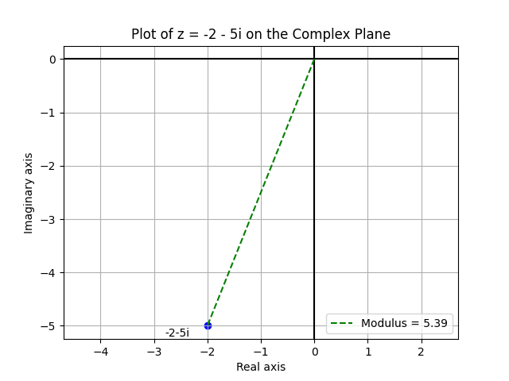
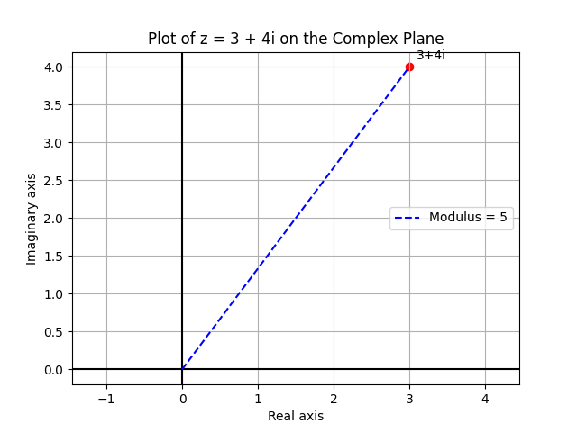

## Representing Complex Numbers on the Complex Plane

Complex numbers take the form $$ z = a + bi $$ where $$ a $$ is the real part and $$ b $$ is the imaginary part. In this lesson, we will explain in detail how to plot these numbers on the complex plane and determine useful properties such as the distance from the origin (called the modulus). This method of representation extends the familiar one-dimensional number line into a two-dimensional space, allowing us to capture both magnitude and direction.

### The Complex Plane

The complex plane is a two-dimensional system where each point corresponds to a unique complex number. It consists of two perpendicular axes:

- The horizontal axis, called the real axis, represents the real component $a$.
- The vertical axis, called the imaginary axis, represents the imaginary component $b$.

Every complex number $$ z = a + bi $$ is plotted as the point $$(a, b)$$, very similar to coordinates in the Cartesian plane.

This visualization provides an easy way to see how complex numbers interact, and it lays the groundwork for understanding operations like addition or finding the modulus, which corresponds to the distance from the origin to the point $$(a, b)$$.

### Plotting a Complex Number

Plotting a complex number is straightforward. Follow these steps for any number $z = a + bi$:

1. Identify the real part $a$ and the imaginary part $b$.
2. Move $a$ units along the horizontal (real) axis. If $a$ is positive, move right; if negative, move left.
3. Move $b$ units along the vertical (imaginary) axis. If $b$ is positive, move upward; if negative, move downward.

Where you finally land is the point that represents the complex number on the complex plane. This process not only locates the number but also provides a visual intuition about its value.

### Example 1: Plotting $$ z = 3 + 4i $$

1. Identify the components: $a = 3$ and $b = 4$.
2. On the real axis, move 3 units to the right since $a$ is positive.
3. On the imaginary axis, move 4 units upward because $b$ is positive.
4. Mark the point $$(3, 4)$$ on the plane.

This point represents the complex number $$ 3 + 4i $$. To further understand its importance, note that the distance from this point to the origin is called the modulus of $z$. The modulus shows how far the number is from zero, similar to the absolute value for real numbers.

The modulus is calculated using the formula:

$$
|z| = \sqrt{a^2 + b^2} = \sqrt{3^2 + 4^2} = \sqrt{9 + 16} = \sqrt{25} = 5.
$$

This calculation comes from the Pythagorean theorem, as the point $$(3, 4)$$ forms a right triangle with the origin. Recognizing this helps to build intuition about the relationship between algebra and geometry.

### Example 2: Plotting $$ z = -2 - 5i $$

1. Here, identify $a = -2$ and $b = -5$.
2. Since $a$ is negative, move 2 units to the left along the real axis.
3. Since $b$ is negative, move 5 units downward along the imaginary axis.
4. Mark the point $$(-2, -5)$$ on the plane.

The modulus is calculated as:

$$
|z| = \sqrt{(-2)^2 + (-5)^2} = \sqrt{4 + 25} = \sqrt{29}.
$$

This result shows that even if the number is in a different quadrant (here the third quadrant), the process for finding its distance from the origin remains the same.

### Visual Representation on the Complex Plane

The diagram below illustrates the complex plane with labeled axes and marks the point representing $$ 3 + 4i $$. This visual aid is designed to center the number line to display both positive and negative values clearly.

<!-- tikzpicture -->

This diagram not only shows the point $$3+4i$$ but also reinforces the idea that its modulus, the distance from the origin, is 5 units. Observing the distance visually helps to cement the concept and provides a bridge between numerical calculations and spatial reasoning.

### Summary of Steps

- Identify the real part $a$ and the imaginary part $b$ of the complex number $z = a + bi$.
- Plot the corresponding point $$(a, b)$$ on the complex plane by moving $a$ units horizontally and $b$ units vertically.
- Calculate the modulus using $$ |z| = \sqrt{a^2 + b^2} $$, which gives the distance of the point from the origin.

By understanding these steps, you gain a clear method for graphing complex numbers. This approach is especially useful in real-world applications such as electrical engineering, where complex numbers represent both voltage and current, or in computer graphics for performing transformations. The visualization of complex numbers lays an important foundation for advanced studies in mathematics and engineering.