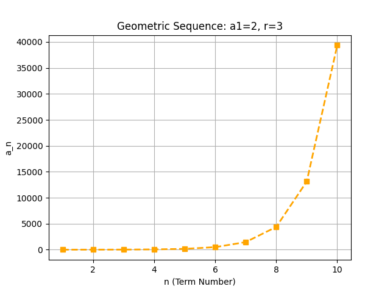
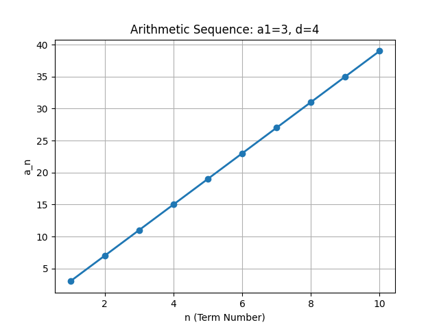

## Arithmetic and Geometric Sequences

Sequences are ordered lists of numbers that follow a specific rule. In this lesson, we focus on two common types of sequences: arithmetic sequences, which have a constant difference between successive terms, and geometric sequences, which have a constant ratio between successive terms. This lesson provides detailed explanations and step-by-step examples to help you understand how to identify, analyze, and apply these sequences in practical situations.

### Arithmetic Sequences

An arithmetic sequence is characterized by a constant difference between consecutive terms. This constant difference, denoted by $d$, is added to each term to obtain the next term. The structure and simplicity of arithmetic sequences make them useful for modeling situations with steady, linear growth or decline.

The formula for the $n$th term of an arithmetic sequence is given by:

$$
a_n = a_1 + (n-1)d
$$

where:

- $a_1$ is the first term
- $d$ is the common difference
- $n$ is the term number

This formula allows you to directly compute any term in the sequence without having to list all the preceding terms.

> In arithmetic sequences, the consistent addition of the same number makes the pattern predictable, which is why these sequences often model regular savings plans or consistent payment hikes.

#### Example 1: Finding a Term in an Arithmetic Sequence

Consider an arithmetic sequence where the first term is $3$ and the common difference is $4$. To find the 8th term, follow these steps:

1. Start with the formula: $$a_8 = 3 + (8-1) \times 4$$
2. Compute the expression $(8-1)$ to get $7$.
3. Multiply $7$ by $4$ to obtain $28$.
4. Add the initial term: $3 + 28 = 31$.

Thus, the 8th term of the sequence is $31$.

This example illustrates how the arithmetic sequence grows by a fixed increment and emphasizes the simplicity of using the formula to reach any term directly.

#### Real-World Application: Payment Plans

Many payment plans use arithmetic sequences. For instance, if you start with a payment of $100$ and increase the payment by $20$ every period, the payments will be: $100$, $120$, $140$, and so on. The fixed increase of $20$ is the common difference, and it ensures that each payment is predictable and traceable.

### Geometric Sequences

A geometric sequence is defined by the fact that each term after the first is obtained by multiplying the previous term by a constant value called the common ratio, denoted by $r$. This multiplicative pattern causes the sequence to grow or decline exponentially, reflecting scenarios such as population growth or compound interest.

The formula for the $n$th term of a geometric sequence is:

$$
a_n = a_1 \times r^{(n-1)}
$$

where:

- $a_1$ is the initial term
- $r$ is the common ratio
- $n$ represents the term number

This formula is particularly helpful because it allows you to quickly find any term in the sequence without computing every previous term.

> Geometric sequences, with their constant multiplication, model diverse real-world phenomena such as bacterial growth and the compounding of interest.

#### Example 2: Finding a Term in a Geometric Sequence

Suppose you have a geometric sequence with an initial term of $2$ and a common ratio of $3$. To determine the 5th term:

1. Begin with the formula: $$a_5 = 2 \times 3^{(5-1)}$$
2. Calculate the exponent: $5-1 = 4$.
3. Compute $3^4$, which equals $81$.
4. Multiply $2$ by $81$ to obtain $162$.

Thus, the 5th term in this geometric sequence is $162$.

This example shows the rapid growth associated with geometric sequences due to repeated multiplication by a constant ratio.

#### Real-World Application: Population Growth

Consider a population of bacteria that doubles every hour. If you start with a single bacterium, the growth pattern forms a geometric sequence where the first term is $1$ and the common ratio is $2$. Such exponential growth is common in biology and finance, where compound interest works on a similar multiplicative basis.

### Comparing Arithmetic and Geometric Sequences

- **Arithmetic Sequences:** Constructed by repeatedly adding a fixed difference. The growth is linear and steady.

- **Geometric Sequences:** Constructed by repeatedly multiplying by a fixed ratio. The growth is exponential and can increase rapidly.

Understanding the distinction between these sequences is vital, especially in fields like finance. For example, arithmetic sequences can model steady savings over time, whereas geometric sequences are used in the calculation of compound interest.

### Additional Example: Identifying the Sequence Type

Examine the sequence: $5$, $10$, $15$, $20$, ...

1. Calculate the differences: $10-5=5$, $15-10=5$, $20-15=5$. The constant difference ($d = 5$) confirms that this is an arithmetic sequence.

Now, consider the sequence: $3$, $6$, $12$, $24$, ...

1. Calculate the ratios: $6/3 = 2$, $12/6 = 2$, $24/12 = 2$. The constant ratio ($r = 2$) indicates a geometric sequence.

These simple checks can help quickly classify the type of sequence you are dealing with.

### Visual Representation

Below is a diagram that represents the progression of an arithmetic sequence on a number line. Each term is evenly spaced, illustrating the constant increment between numbers.

<!-- tikzpicture -->

The diagram visually communicates the regular spacing found in arithmetic sequences. In geometric sequences, similar visualization would show uneven spacing due to the multiplication factor, which can be illustrated using charts or logarithmic scales when necessary.

By mastering the formulas and methods shown in this lesson, you build a strong foundation for more advanced topics. Knowing how to determine the common difference or ratio and calculate the $n$th term is essential for further studies in series, limits, and even calculus.