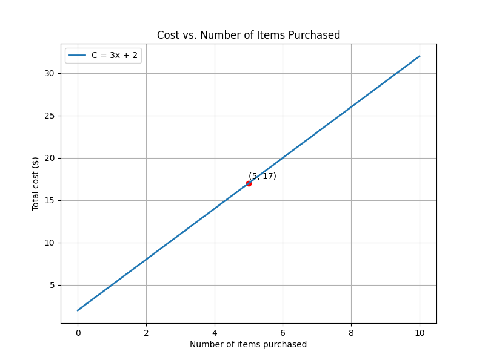
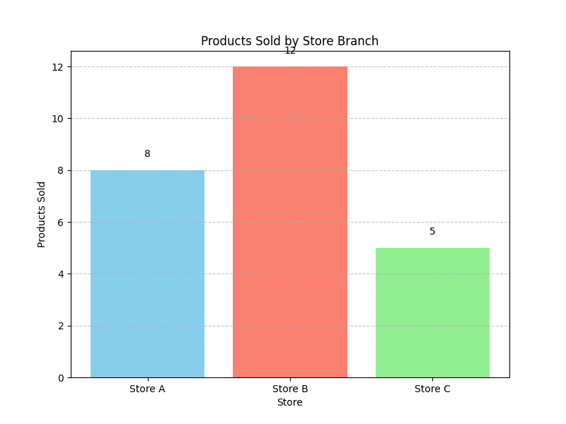
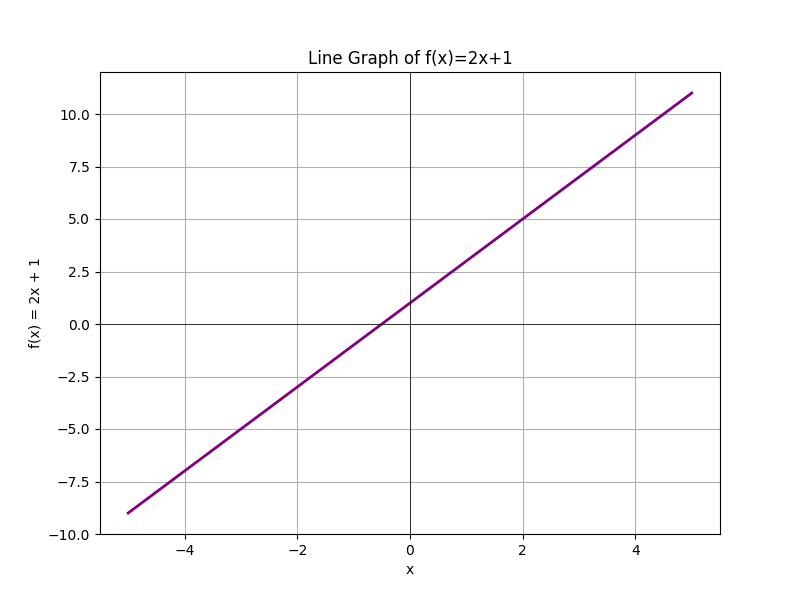

## Interpreting and Analyzing Graphical Data

Graphs are visual tools that display numerical relationships between two or more variables. In this lesson, you will learn how to read graphs, extract key pieces of information, and analyze data trends. This ability helps in predicting behaviors and making informed decisions in fields such as finance, engineering, and science.

### Key Components of a Graph

A graph typically includes several basic elements. Understanding these components is important for effective interpretation.

- **Axes:** The horizontal axis ($x$-axis) and the vertical axis ($y$-axis) represent different variables. The $x$-axis usually shows the independent variable, while the $y$-axis shows the dependent variable.

- **Scale and Units:** The numbers along each axis indicate the scale, which determines how data is measured. The units give context to the data values, ensuring clarity on what is being represented.

- **Labels:** Textual descriptions assigned to each axis explain what the graph represents. Labels provide immediate context and help avoid misinterpretation of the data.

- **Data Points or Lines:** These are the marks (dots, lines, or bars) that represent the data. They illustrate how one variable changes in relation to another.

> Interpreting graphical data correctly allows us to predict trends and make informed decisions.

### Steps for Analyzing Graphical Data

When analyzing any graph, follow these essential steps:

1. **Identify the Variables:** Begin by determining what is represented on each axis. For example, if the $x$-axis represents time and the $y$-axis represents speed, the graph shows how speed varies over time.

2. **Examine the Scale and Units:** Look at the intervals marked on both axes. Understanding the scale helps you grasp the magnitude of the data, which is important when comparing values or calculating differences.

3. **Look for Trends:** Check if the graph shows an overall upward trend (increase), downward trend (decrease), or remains mostly constant. Trends are often associated with the slope of a line; a steeper slope indicates a faster rate of change.

4. **Calculate the Slope (if applicable):** For graphs that include a straight line, the slope gives the rate of change between the two variables. The slope is calculated as:

$$
\text{slope} = \frac{\Delta y}{\Delta x}
$$

This means the difference in $y$ divided by the difference in $x$. A positive slope shows an increase, while a negative slope indicates a decrease.

5. **Determine Intercepts and Key Points:** Identify where the graph crosses the axes. The point where it crosses the $y$-axis is the $y$-intercept, and similarly, the $x$-intercept is where it crosses the $x$-axis. In addition, note any maximum, minimum, or other significant points that highlight important changes in the data.

### Example 1: Reading a Linear Graph

Suppose you have a graph that represents the total cost ($y$) of buying items over the number of items purchased ($x$). The graph is a straight line with a slope of $3$ and a $y$-intercept of $2$. This information implies:

- Every additional item increases the cost by $3 dollars.
- There is a fixed cost of $2 dollars even if no items are purchased.

The corresponding equation of the line is:

$$
C = 3x + 2

$$

**Step-by-Step Analysis:**

1. **Identify Variables:**
   - $x$-axis: Number of items purchased.
   - $y$-axis: Total cost in dollars.

2. **Interpret the Slope:**
   - The slope of $3$ means that for every 1 unit increase in the number of items, the cost increases by $3 dollars.
   - This rate of change indicates a linear relationship where cost increases uniformly.

3. **Find a Value:**
   - To calculate the cost for 5 items, substitute $x=5$ into the equation:

$$
C = 3(5) + 2
$$

Simplify the equation:

$$
C = 15 + 2 = 17
$$

Thus, the total cost for 5 items is $17.

### Example 2: Analyzing a Bar Graph

Consider a bar graph that shows the number of products sold by three different stores: Store A, Store B, and Store C. The heights of the bars correspond to 8, 12, and 5 respectively.

**Step-by-Step Analysis:**

1. **Identify Categories and Values:**
   - Each bar represents a different store branch.
   - The height of each bar represents the number of products sold in that branch.

2. **Compare the Data:**
   - Store B sold the most products with a value of 12, whereas Store C sold the fewest with a value of 5.

3. **Draw a Conclusion:**
   - A business decision, such as selecting a location to expand, might favor the branch with higher sales (Store B) because of its higher demand.

### Visualizing a Line Graph

Below is an example of a simple line graph representing the function $f(x)=2x+1$. This function can model a steady increase in a quantity over time.

<!-- tikzpicture -->

**Analyzing the Graph:**

- The line rises consistently, confirming a constant rate of change or slope of $2$.

- The $y$-intercept is at $f(0)=1$, which indicates the initial value when $x=0$.

The graph clearly displays how the value of $f(x)$ increases as $x$ increases, supporting the function's linear relationship.

### Concluding Remarks on Graph Analysis

Following these systematic steps—identifying variables, examining scales, observing trends, calculating slopes, and finding intercepts—enhances your ability to interpret graphs accurately. Understanding these procedures builds intuition, helping you connect numerical data to real-world applications such as budgeting, engineering design, and scientific research.

By mastering these techniques, you develop a strong foundation for tackling more complex algebraic problems, an essential skill for the College Algebra CLEP exam.